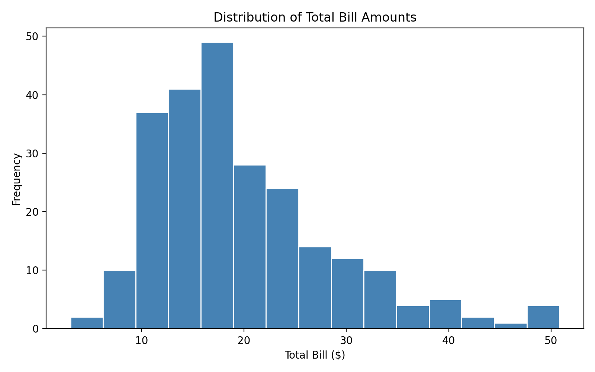

# PRODIGY_DS_01

**Task 01** – Create a bar chart and histogram to visualize the distribution of a categorical and continuous variable.

## Dataset

**Seaborn's `tips` dataset** — contains information about restaurant tips, including:
- `total_bill` — total bill amount (continuous)
- `tip` — tip amount (continuous)
- `sex` — gender of the payer (categorical)
- `smoker` — whether the party included smokers (categorical)
- `day` — day of the week (categorical)
- `time` — lunch or dinner (categorical)
- `size` — party size (continuous)

## Visualizations



1. **Histogram** – Distribution of total bill amounts (15 bins)
2. **Bar chart** – Average tip by day of the week, grouped by sex

## How to run

```bash
pip install pandas matplotlib seaborn
python PRODIGY_DS_01.py
```

## Tech Stack

- Python 3.14
- pandas
- matplotlib
- seaborn
