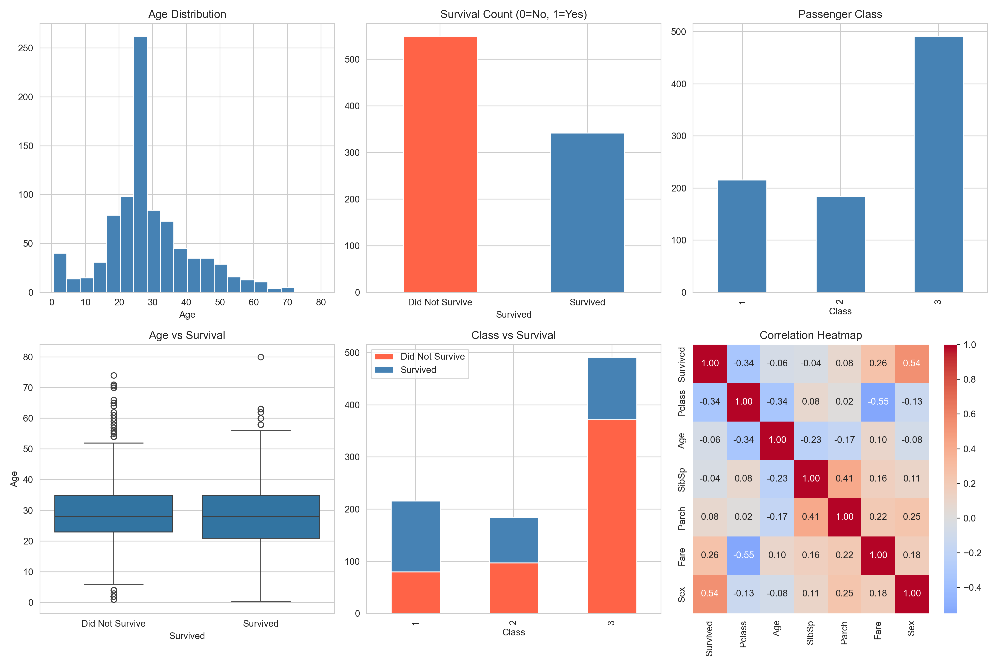

# PRODIGY_DS_02

**Task 02** – Data Cleaning and Exploratory Data Analysis (EDA) on the Netflix Movies and TV Shows dataset.

## Dataset

**Netflix Movies and TV Shows** — contains listings of all movies and TV shows available on Netflix, including:
- `type` — Movie or TV Show
- `title` — Name of the content
- `director` — Director(s)
- `cast` — Main actors/actresses
- `country` — Production country/countries
- `date_added` — Date added to Netflix
- `release_year` — Original release year
- `rating` — Maturity rating (TV-MA, TV-14, etc.)
- `duration` — Duration in minutes (movies) or seasons (TV shows)
- `listed_in` — Genre classification
- `description` — Short synopsis

## Steps Performed

1. **Data Import** – Loaded dataset from URL
2. **Data Inspection** – Checked shape, columns, info, summary statistics
3. **Missing Values** – Identified and handled missing values (director, cast, country, rating, duration, date_added)
4. **Duplicate Removal** – Checked and removed duplicate rows
5. **Data Cleaning** – Stripped whitespace, fixed inconsistent ratings, parsed date/duration columns
6. **Feature Engineering** – Created columns: year_added, month_added, main_country, main_genre, duration_minutes, seasons
7. **Exploratory Data Analysis** – 9 visualizations covering content type, countries, genres, ratings, trends, duration, and seasons

## Visualizations



1. **Count of Movies and TV Shows**
2. **Top 10 Countries with Most Netflix Content**
3. **Top 10 Genres on Netflix**
4. **Top 10 Content Ratings**
5. **Content Added Over the Years**
6. **Distribution of Release Years**
7. **Movie Duration Distribution**
8. **TV Show Seasons Distribution**
9. **Relationship Between Content Type and Rating**

## Key Findings

- Netflix has more Movies (4,265) than TV Shows (1,969)
- United States and India are the top content-producing countries
- Dramas, International Movies, and Comedies are the most common genres
- Most content is rated TV-MA, TV-14, or TV-PG
- Content additions peaked in recent years (2018–2020)
- Most movies are 80–120 minutes long
- Most TV shows have only 1 or 2 seasons

## How to Run

```bash
pip install pandas matplotlib seaborn
python PRODIGY_DS_02.py
```

## Tech Stack

- Python 3
- pandas
- matplotlib
- seaborn
